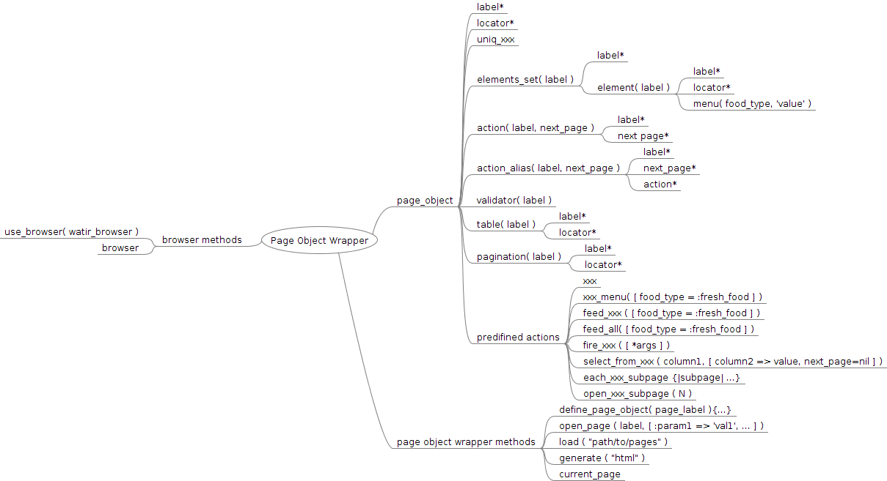

# PageObjectWrapper

Wraps watir-webdriver with convenient testing interface, based on PageObjects automation testing pattern. Simplifies resulting automated test understanding.  
*Warning:* version 1.0 and higher are not compatible with older versions

## Installation

Install Firefox on your system

Add this line to your application's Gemfile:

    gem 'page_object_wrapper'

And then execute:

    $ bundle

Or install it yourself as:

    $ gem install page_object_wrapper

## Usage
#####please look into specs for more detailed usage examples

### Basic usecase is following
1. Define page object with PageObjectWrapper.define\_page
2. Use defined page object inside your tests with usefull page\_object #methods

### Basic principles of a PageObjectWrapper
- there are following objects: page\_object, elements\_set with elements, table, action, pagination  
- a page_object contains elements\_sets, tables, actions, paginations
- an elements\_set contains elements
- every object has a :label
- a label identifies the object

Here in the structure of PageObjectWrapper:

### Examples

#### definition example

      PageObjectWrapper.define_page(:some_test_page) do
        locator 'http://www.cs.tut.fi/~jkorpela/www/testel.html'
        uniq_h1 :text => 'Testing display of HTML elements'

        elements_set(:test_elements) do
          text_field(:tf) do
            locator :id => 'f1'
            missing_food 'some missing food'
            fresh_food 'some fresh food'
          end

          textarea(:ta) do
            locator :id => 'f2'
          end
          
          select(:s1) do
            locator :id => 'f10'
            fresh_food 'one'
            missing_food 'three'
          end

          select(:s2) do
            locator :id => 'f11'
            fresh_food 'one'
          end

          checkbox(:cb){ locator :id => 'f5' }
          radio(:rb){ locator :id => 'f3' }

        end

        action(:press_cool_button, :test_page_with_table) do
          button(:name => 'foo').when_present.click
        end

        action(:fill_textarea, :some_test_page) do |fill_with|
          data = (fill_with.empty?)? 'Default data' : fill_with
          textarea(:id => 'f2').set data
        end

        table(:table_without_header) do
          locator :summary => 'Each row names a Nordic country and specifies its total area and land area, in square kilometers'
        end

        table(:table_with_header) do
          locator :summary => 'Each row names a Nordic country and specifies its total area and land area, in square kilometers'
          header [:country, :total_area, :land_area]
        end

        pagination(:some_pagination) do
          locator :xpath => ''
        end
      end

here we have defined a page object with locator (url) = 'http://www.cs.tut.fi/~jkorpela/www/testel.html'  
uniq\_xxx is used to define a uniq element on that page, which uniquely identifies the page from other pages  
uniq\_xxx is being checked when openning the page with PageObjectWrapper.open\_page and when running an page\_object.action  

#### openning the page
*preconditions*  
There is a directory, where we've defined a page\_object inside a \*\_page.rb file

1. specify browser to be used by PageObjectWrapper  
     @b = Watir::Browser.new  
     PageObjectWrapper.use_browser @b  
2. load defined pages  
     PageObjectWrapper.load("path/to/pages/directory")  
3. open page in browser  
     test_page = PageObjectWrapper.open_page(:some_test_page)  

*comments*
- it's possible to use any Watir::Browser with any profile
- it's possible to use any Webdriver, which behaves like Watir::Browser (meaning that Webdriver uses similar methods for locating elements and working with them)    
- .load method validates all pages, defined in specified directory inside any \*\_page.rb file
- it's possible to define several page objects in one file
- .open\_page method takes page label, directs browser to that page and returns corresponding page\_object
- PageObjectWrapper.current\_page points to the opened page\_object
- it's possible to set page\_object locator in 2 different ways: specifying full url (like in example) or specifying PageObjectWrapper.domain and page\_object local path (like in specs)

#### page\_object.xxx
Defined elements can be accessed with their labels.
- element from an element\_set is corresponds to real Watir::Element
- elemets\_set corresponds to an Array of Watir::Element  

*preconditions*
tp is a :some\_test\_page object opened in the browser

      tp.tf # => Watir::TextField
      tp.rb # => Watir::Radio
      tp.test\_elements # => Array of Watir elements

#### feed\_xxx
*preconditions*  
tp is a :some\_test\_page object opened in the browser

    context "argument = :fresh_food" do
      it "populates all xxx elements with :fresh_food" do
        tp = PageObjectWrapper.current_page
        tp.feed_test_elements(:fresh_food)
      end
    end

    context "argument = nil" do
      it "populates all xxx elements with :fresh_food" do
        tp = PageObjectWrapper.current_page
        tp.feed_test_elements
      end
    end

    context "argument = :missing_food" do
      it "populates all xxx elements with :missing_food" do
        tp = PageObjectWrapper.open_page(:some_test_page)
        tp.feed_test_elements(:missing_food)
      end
    end

#### fire\_xxx
*preconditions*  
tp is a :some\_test\_page object opened in the browser

    it "executes fire_block in Watir::Browser context" do
      tp = PageObjectWrapper.open_page(:some_test_page)
      tp.fire_fill_textarea
    end

    it "can be invoked with parameters" do
      tp = PageObjectWrapper.current_page
      tp.fire_fill_textarea('User defined data')
    end

    it "returns next_page" do
      tp = PageObjectWrapper.current_page
      np = tp.fire_press_cool_button
    end

#### select\_from\_xxx
*preconditions*  
tp is a :some\_test\_page object opened in the browser  
its syntax is close to SQL *'select column1 from page\_object.some\_table where column2 = string\_or\_regexp'*     
      page\_object.select\_from\_xxx( :column1, :column2 => 'string\_or\_regexp' )    
correct arguments are:  
:column1 is a column value from which you want to receive   
:column2 is a column which is used to get specific row   

    context "where == nil" do
      it "returns last row value from provided column" do
        tp.select_from_table_without_header(:column_0).text.should eq 'Sweden'
        tp.select_from_table_without_header(:column_1).text.should eq '449,964'
        tp.select_from_table_without_header(:column_2).text.should eq '410,928'
      end
    end

    context "where not nil" do
      context "found by String" do
        it "returns found cells" do
          tp.select_from_table_without_header(:column_0, :column_1 => '103,000').text.should eq 'Iceland'
          tp.select_from_table_with_header(:country, :total_area => '337,030').text.should eq 'Finland'
        end
        it "returns nil" do
          tp.select_from_table_without_header(:column_0, :column_1 => '123').should eq nil
          tp.select_from_table_with_header(:country, :total_area => '123').should eq nil
        end
      end
      context "found by Regexp" do
        it "returns found cells" do
          tp.select_from_table_without_header(:column_0, :column_1 => /103/).text.should eq 'Iceland'
          tp.select_from_table_with_header(:country, :total_area => /337/).text.should eq 'Finland'
        end
        it "returns nil" do
          tp.select_from_table_without_header(:column_0, :column_1 => /123/).should eq nil
          tp.select_from_table_with_header(:country, :total_area => /123/).should eq nil
        end
      end
    end

#### each\_xxx
TODO
#### open\_xxx
TODO
## Contributing

1. Fork it
2. Create your feature branch (`git checkout -b my-new-feature`)
3. Commit your changes (`git commit -am 'Add some feature'`)
4. Push to the branch (`git push origin my-new-feature`)
5. Create new Pull Request  

##page\_object\_wrapper
Wraps watir-webdriver with convenient testing interface, based on PageObjects automation testing pattern. Simplifies resulting automated test understanding.
